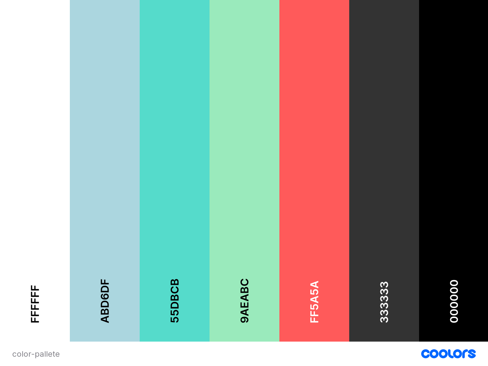

<h1 align="center"><a href="https://cesargarciajr.github.io/QuizTmas/" target="_blank">QuizTimas</a></h1> 

This game was developed to challange your knowledge with fun fact about Christmas. Its a combinations of a memory game template but instead of pictures when a card is clicked you trigger a question quiz, which makes more exciting when playing bacause you can get to pick easy questions or really difficult ones. Chellange your friends and have a fun Christimas!! Ho Ho Ho

[**Link to QuizTmas**](https://cesargarciajr.github.io/QuizTmas/)

# Contents

- [Quiztimas](#quiztimas)
- [Contents](#contents)
  - [User Experience (UX)](#user-experience-ux)
    - [User Stories](#user-stories)
    - [Wireframes](#wireframes)
    - [Site Structure](#site-structure)
    - [Desing Choices](#design-choices)    
  - [Features](#features)
    - [Play Page](#play-page)
    - [Modal PopUp](#modal-popup)
    - [Answer Buttons](#answer-buttons)
    - [TimesUp Alert](#timesup-alert)
    - [TimesUp Alert](#timesup-alert)
    - [Hidden Cards](#hidden-cards)
    - [Game Over Message](#game-over-message)
    - [Rules Page](#rules-page)
    - [Contact Page](#contact-page)
    - [Future Features](#future-features)
  - [Testing](#testing)
    - [Testing Process](#testing-process)
    - [Bugs and Issues](#bugs-and-issues)
  - [Technologies Used](#technologies-used)
  - [Deployment](#deployment)
  - [Credits](#credits)
    - [Content](#content)
    - [Media](#media)
  - [Acknowledgments](#acknowledgments)
- [THANK YOU!](#thank-you)

___

## User Experience (UX)

  ### User Stories

  - #### First-Time Visitor Goals
     i.   As a First time user I want to be able to intuitively learn how to play the game without even reading the Game.
     ii.  But if needed check the Rules and see if its clear.
     iii. I might have to contact the developer for any bug or leave a message.
     iv.  Have fun!

  - #### Returning Visitor Goals
     i.   As returning user I want the be able to play the game straight away.
     ii.  Check if there is anyupdates to the game.
     iii. Have fun!

  - #### Frequent User Goals
    i.   As returning user I want the be able to play the game straight away.
    ii.  Check if there is anyupdates to the game.
    iii. Have fun!

  [Back to top](<#contents>)
  
  - ### Wireframes

    The wireframes for QuizTmas were produced in [**Balsamiq**](https://balsamiq.com). There are frames for a full width display and a small mobile device. The final site varies slightly from the wireframes due to developments that occured during the creation process.

    

[Back to top](<#contents>)

  - ### Site Structure

    The QuizTmas game was structured in HTML in 3 different pages: [**Play**], [**Rules**] and [**Contact**]. All the styling was developed in CSS and the logic in vanilla JavaScript. Its a combinations of a memory game template but instead of pictures when a card is clicked you trigger a question quiz, which makes more exciting when playing bacause you can get to pick easy questions or really difficult ones. The effects and transitions combined with modal popup engine makes the whole experience more pleasant and a feeling of well built.
    

[Back to top](<#contents>)

  - ### Design Choices
    The idea of the design of the game was to blend a memory game template but instead of pictures when a card is clicked you trigger a question quiz, which makes more exciting when playing bacause you can get to pick easy questions or really difficult ones, full of animatinos in 3D and smooth transitions to make the UX even more seamless and intuitive.

    - #### Typography
        - Mountains of Christmas font from [**Google Fonts**](https://fonts.google.com/)

        

        - Wix Madefor Display font from [**Google Fonts**](https://fonts.google.com/)

        

    - #### Color Scheme

  

[Back to top](<#contents>)

## Features

  ### Play Page
    The Play Page is also the landing page, where the user can easily learn and understand the website. It consists with a TOP Link over the "QuizTmas" title, a navegation bar that directs to the differents pages and the Play Area. Where the user car see 25 different cards also a Tally area, where all the right answers, wrong answers and number of questions already answered. Can game is very intuitive smooth to play. All the style choices where made based on Christmas theme, to make it more fun, enjoyable and exciting.

   

[Back to top](<#contents>)

  ### Modal PopUp
    Once you click in on of th cards a moldal popup pops and display a random question from a pool of 50 different fun facts questions about Christmas. The modal pop up design is user friendly and easy to understand how to play. A timer starts to countdown from 15 seconds for the user to pick one of the questions.

   
  
[Back to top](<#contents>)
        
  ### Answer Buttons
    The answers buttons display 4 buttons. Three of them are wrong answers and only one is right. If the right answered is picked it will turn the button into a green color. If the wrong answers is picked, is will turn the button into a red color and display the right answer in green color as the countdown timer stops and a next button is displayed to close the modal popup and allow the user to go back to the play area and pick another card.

   

[Back to top](<#contents>)

  ### TimesUp Alert
    If the user does not manage to pick a answer in time. a alert is displayed with a "TimesUp!" message. And a wrong answers will be incremented.

   
 
[Back to top](<#contents>)

  ### Hidden Cards
    Every time the user picks a card. The card will desapear so the user knows the ones already picked and the ones left in a very interactive proposal.

   
 
[Back to top](<#contents>)

  ### Game Over Message
    Once the user picked 10 cards a Game Over message will display and show the amount of correct answers wrong answers. Also a restart button the will reload the page and restart the game. 

   
 
[Back to top](<#contents>)

  ### Rules Page
    It's a simple page where all the rules are explained to the user, easy, clear and simple to understand.

   
 
[Back to top](<#contents>)

  ### Contact Page
    Contact page the user can reach the developer in any of the three links provided that will open in a different tab for better UX.

   
 
[Back to top](<#contents>)

  ### Future Features

    We want to implement 2 different surprise cards. So everytime the user picks a card he can either pick a Santa Claus picture, a Grinch picture or a question.
    If the user picks a Santa Claus it will give him a 2 points Bonus. If the user picks a Grinch card it will lose 3 points, and if the user picks a question he has a chance either to win one point by picking the right answer or lose a point. 

[Back to top](<#contents>)

## Testing

- Tested in differents mobile devices and web browsers
- Tested using the [**CCS validador**](https://www.w3.org/)
- Tested using the [**HTML validator**](https://validator.w3.org/nu/)
- Tested using the [**JsHint Validator**](https://jshint.com/)
- Tested using the Lightroom dev tool from Google Chrome

You can see the reports below as mentioned before:

[Back to top](<#contents>)

 ### Bugs and Issues

[Back to top](<#contents>)

___

## Technologies Used
I used the following technologies, platforms and support in building my project:
- Wireframes and mockups were designed in [**Balsamiq**](https://balsamiq.com/wireframes/desktop/#)
- The website is built with HTML, CSS and JavaScript.
- The [**Code Institute**](https://codeinstitute.net/) modules/lessons aided my learning and many of the concepts learned were applied in this project.
- [**GitHub**](https://github.com/Cesargarciajr/bloom-of-life) was used for the project repository.
- [**Google Fonts**](https://fonts.google.com/) was used for all fonts on the site.
- [**FontAwesome**](https://fontawesome.com/) was used for the social media icons which then had additional styling applied to them.
- [**Colors CO**](https://coolors.co/) was used to create a colour pallete for this readme file.
- [**Adobe Colors**](https://color.adobe.com/pt/create/color-contrast-analyzer) and contrast was used to pick color and check if the contrast was good enough for users.

[Back to top](<#contents>)

## Deployment

First of all you need to have a [**GitHub**](https://github.com/Cesargarciajr/bloom-of-life) account, I choose [**GitHub**](https://github.com/Cesargarciajr/bloom-of-life) because it's free and easy to create a repository to host your code and share with others.

- To create a repository you just need to go to the main page at the top right you will see a "+" button just click here and then new repository

- Select the name of the project and a description make it public and then create a repository

- Once you created your repository go the settings section and then click on pages

- Select the Branch as main and then save it.

- Finally, your repository is deployed and it should show you a link so you can share it with others.

[Back to top](<#contents>)

## Credits

  ### Content  
  - [**Code Institute**](https://codeinstitute.net/)  - JavaScript Module and Tutor Support.
  - [**GitHub**](https://github.com/) - for deployment and host.
  - [**GitPod**](https://gitpod.io/) - for IDE and editor of the code.
  - [**Precious Ijege**](https://www.linkedin.com/in/precious-ijege-908a00168/) - Mentor helping with insights and coding fix.
  - [**CSS Tricks**](https://css-tricks.com/) - learn how to style better in CSS.
  - [**Jot Form**](https://www.jotform.com/) - learn how to create and style forms in html.
  - [**HubSpot**](https://blog.hubspot.com/website/how-to-embed-google-map-in-html) - learn how to use Google Maps API.
  - [**W3 Schools**](https://www.w3schools.com/) - used for multiples researches and tutorials in HTML and CSS.
  - [**Color Hunt**](https://colorhunt.co/) - used to select colors of the project.
  - [** Mmdn Web Docs**](https://developer.mozilla.org/en-US/docs/Web/API/EventTarget/removeEventListener) - learned how to remove html elements using DOM.
  - [**Favicon Generator**](https://realfavicongenerator.net/) - used to generate a favIcon.
  - [**Chat GPT**](https://chat.openai.com/) - used to generate the pool of 50 themed questions and answers.
  - [**FreeCodeCamp**](https://www.youtube.com/@freecodecamp) - Watched tutorials how to make flip card effect.
  - [**Easy Tutorials**](https://www.youtube.com/@EasyTutorialsVideo) - Watched tutorials how to make buttons for quiz answers.
  - [**Web Dev Simplified**](https://www.youtube.com/@WebDevSimplified) - Watched tutorials how to make modal popup.
  - [**The WebShala**](https://www.youtube.com/@TheWebShala) - Watched tutotirals how to make questions shows randomly.

[Back to top](<#contents>)

  ### Media
- [**Pexel**](https://www.pexels.com/) - for images and photos.
- [**iStock**](https://www.istockphoto.com/) - for images and photos.
- [**TinyPNG**](https://tinypng.com/) - resizing images.
- [**Adobe Color**](https://color.adobe.com/pt/create/color-contrast-analyzer) - used to check contrast between the colors picked for project.
- [**Colors CO**](https://coolors.co/) was used to create a colour pallete for this readme file.
- [**Balsamiq**](https://balsamiq.com/wireframes/) - used for wireframes.
- [**Font Awesome**](https://fontawesome.com/) - used for icons.
- [**Google fonts**](https://fonts.google.com/) - for fonts used in this project.
- [**Am I Resposive**](https://ui.dev/amiresponsive/) - for the  Hero image in the ReadMe file.
- [**ConvertIO**](https://convertio.co/) - used to convert all the photos to webp format file.

[Back to top](<#contents>)

## Acknowledgments

by [**Cesar Garcia**](https://github.com/Cesargarciajr)

# THANK YOU!

[Back to top](<#contents>)
